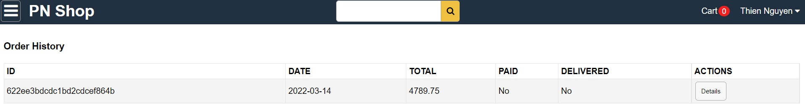

# PN Shop ECommerce Web App

## Run Locally

### 1. Setup MongoDB

- Local MongoDB
  - Install it from [here](https://www.mongodb.com/try/download/community)
  - Create .env file in root folder
  - Set MONGODB_URL=mongodb://localhost/amazona  
- Atlas Cloud MongoDB
  - Create database at [https://cloud.mongodb.com](https://cloud.mongodb.com)
  - Create .env file in root folder
  - Set MONGODB_URL=mongodb+srv://your-db-connection

### 2. Run Backend

```
$ npm install
$ npm start
```

### 3. Run Frontend

```
# open new terminal
$ cd frontend
$ npm install
$ npm start
```

### 4. Seed Users and Products

- Run this on browser: http://localhost:5000/api/users/seed
- It returns 1 admin, 5 sellers, and 1 user's emails and passwords
- Run this on browser: http://localhost:5000/api/products/seed
- It creates 8 sample products

## Set up GOOGLE_API_KEY

- Please enter your own GOOGLE_API_KEY in .env file. Example: GOOGLE_API_KEY=<YOUR API KEY>
- Enable "Maps JavaScript API"

## Limitation

- Running two seeds http://localhost:5000/api/users/seed & http://localhost:5000/api/products/seed in the beginning will assign all products to the very first seller in database.
- However, if you generate sellers by seed http://localhost:5000/api/users/seed first. Then, logging to sellers'account to create their own products --> The problem will be solved!

# Demo

<br />
<br />
<br />
<br />
<br />
<br />
<br />
<br />
<br />
<br />
<br />
<br />
<br />
<br />
<br />
<br />
<br />
<br />

